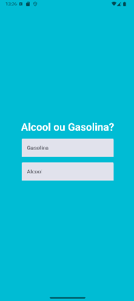
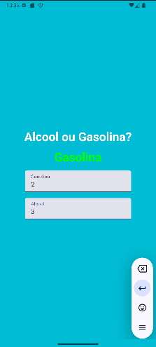
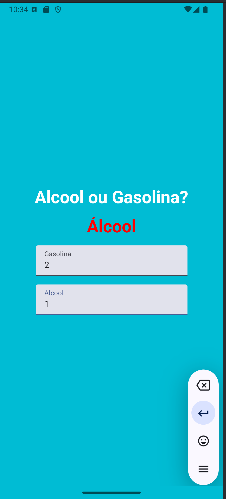

# Comparador de Combustíveis - Álcool vs Gasolina 💫

Este é um aplicativo simples desenvolvido com **Jetpack Compose** para ajudar a decidir qual combustível é mais vantajoso entre **álcool** e **gasolina**. O aplicativo recebe dois inputs: o preço do litro de álcool e o preço do litro da gasolina. Ele calcula qual dos dois combustíveis oferece o melhor custo-benefício com base em uma regra simples: 

- Se o preço do álcool for menor que **70%** do preço da gasolina, o álcool é mais vantajoso. Caso contrário, a gasolina é a melhor opção.

## Funcionalidades

- Entrada do preço do litro de álcool.
- Entrada do preço do litro de gasolina.
- Cálculo simples para determinar qual combustível é mais vantajoso.
- Exibição do resultado na tela.

## Como funciona

1. O usuário insere os valores dos preços de **álcool** e **gasolina**.
2. O aplicativo calcula qual combustível oferece o melhor custo-benefício.
3. O resultado é mostrado na tela, indicando qual combustível é mais barato com base na comparação.

## Screenshots

